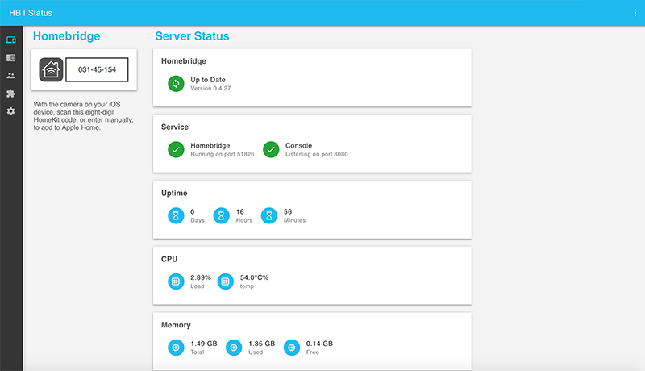

# Homebridge Config UI

Dies ist ein Plugin für Homebridge [Homebridge](https://github.com/nfarina/homebridge)

Dieses Plugin erlaubt dir, in einem Browser, deine Homebridge-Konfiguration anzuzeigen, zu sichern und zu ändern.



# Installationsanleitung

Zuerst das Plugin installieren
```Bash
sudo npm i -g homebridge-config-ui
```

### Für Supervisord

Füge dies zur ~/.homebridge/config.json Datei hinzu
```JSON
{
    "platform": "config",
    "name": "Config",
    "port": 8080,
    "log": "/var/log/homebridge.stdout.log",
    "error_log": "/var/log/homebridge.stderr.log",
    "restart": "/usr/local/bin/supervisorctl restart homebridge"
}
```

In diesem Beispiel wird [supervisor](http://supervisord.org/) verwendet, um Homebridge zu steuern. Dies ist eine gute Anleitung für supervisor: [Supervisor auf OSX verwenden](https://nicksergeant.com/running-supervisor-on-os-x/)

Ersetze <b>/var/log/homebridge.stdout.log</b> mit dem Pfad zu deinem Homebridge output log.<br />
Ersetze <b>/var/log/homebridge.stderr.log</b> mit dem Pfad zu deinem Homebridge error log.<br />
Ersetze <b>/usr/local/bin/supervisorctl restart homebridge</b> mit dem Befehl, um deine Homebridge neu zu starten.

### Für Systemd

Füge dies zu deiner /var/homebridge/config.json Datei hinzu
```JSON
{
    "platform": "config",
    "name": "Config",
    "port": 8080,
    "log": "/var/log/daemon.log",
    "restart": "sudo systemctl restart homebridge.service"
}
```

Ersetze <b>/var/log/daemon.log</b> mit dem Pfad zu deinem Homebridge output log.<br />
Ersetze <b>sudo systemctl restart homebridge.service</b> mit dem Befehl, um deine Homebridge neu zu starten.

# Erster Start

Nach dem Installieren kannst du die Oberfläche unter http://localhost:8080 aufrufen. Der standard Nutzername ist <b>admin</b> und das standard Passwort ist <b>admin</b>.

# Nutzung

Anmeldebildschirm

Viele deiner Plugin Konfigurationen enthalten Nutzernamen und Passwörter. Um dies geschützt zu halten, besitzt dieses Plugin eine standard Authentifizierung. Die Nutzer sind in der Datei ~/.homebridge/auth.json hinterlegt.


Status Bildschirm

Hier siehst du, ob Homebridge ausgeführt wird. Auch dein HomeKit PIN wird hier angezeigt.


Anzeige der Log Datei

Live Anzeige des Logs. Kann sehr hilfreich sein, falls Probleme auftreten sollten.


Bildschirm Konfiguration

In der Konfiguration kannst du Homebridge Einstellungen ändern und Einträge zur config.json Datei hinzufügen.


